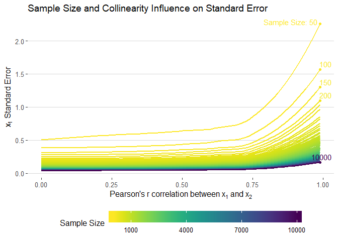
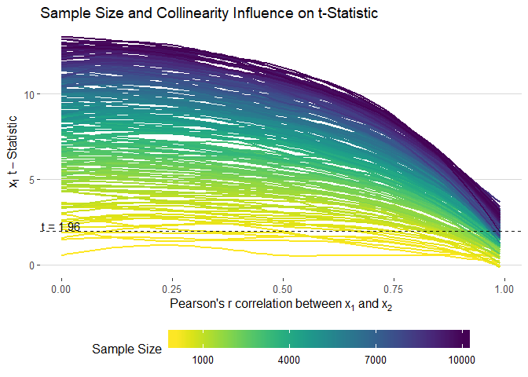
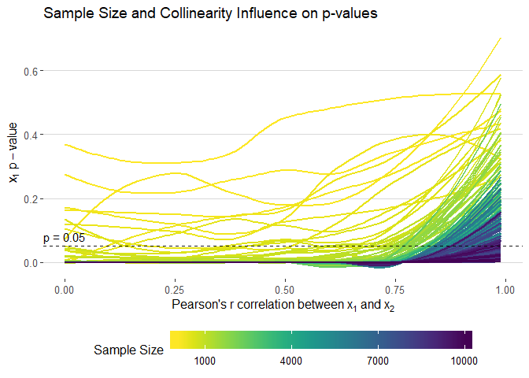
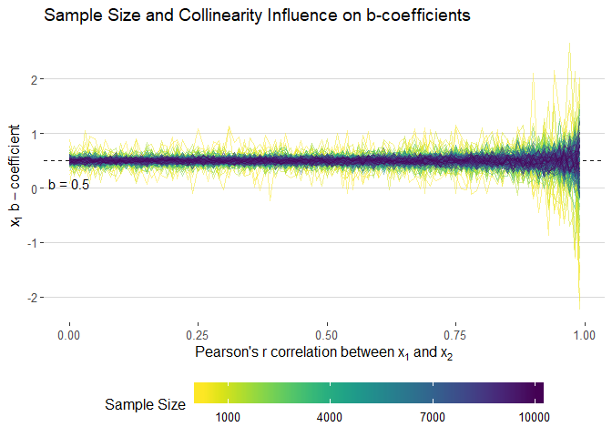
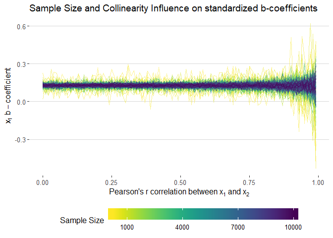

How does Collinearity Influence Linear Regressions?
================
Fabio Votta
29 August 2018

## Load Packages

## Simulation Function

``` r
generate_multi <- function(n, cor_seq){
  set.seed(2017)
  x <- runif(n, 1, 10)
  models <- list()
  std.models <- list()
  for (jj in seq_along(cor_seq)) {
    ## generate correlated variable x2
    dat <- data.frame(corgen(x = x, r = cor_seq[jj],  epsilon = 0))
    colnames(dat) <- c("x1", "x2")
    ## generate y variable
    dat$y <- 0.5 * dat$x1 + 0.5 * dat$x2 + rnorm(n, sd = 10)
    ## modelling and tidy dataframe
    models[[jj]] <- tidy(lm(y ~ x1 + x2, data = dat))
    ## get standardized betas
    std.models[[jj]] <- data.frame(lm.beta::coef.lm.beta((lm.beta::lm.beta(lm(y ~ x1 + x2, data = dat)))))
    colnames(std.models[[jj]]) <- c("std.estimate")  
    ## bind it together
    models[[jj]] <- std.models[[jj]] %>% 
                      bind_cols(models[[jj]]) 
    models[[jj]]$cors <- cor_seq[jj]
  }
  sim_dat <- bind_rows(models)
  sim_dat$col <- n
  return(sim_dat)
}

draw.data <- function(cor_seq = NULL, step_seq = NULL){
    sim.list <- list()
    for(jj in seq_along(step_seq)) {
      sim.list[[jj]] <- generate_multi(n = step_seq[jj], cor_seq)
      sim.list[[jj]]$n <- step_seq[jj]
      
      cat(paste0("Batch: ", jj, "\t"))
      
    } 
    sim_data <- bind_rows(sim.list)
    return(sim_data)
}
```

## Simulate Data

``` r
sim_data <- draw.data(cor_seq = seq(0,.99,0.01), step_seq = seq(50, 10000, by = 50))

if(!dir.exists("data")) dir.create("data")

save(sim_data, file = "data/sim_data.Rdata")
```

## Visualizing the Influence of Collinearity

``` r
load("data/sim_data.Rdata")
```

### Standard Errors

``` r
get_smooths <- function(smooth_dat, n_val, y) {
  smooth_dat <- filter(smooth_dat, n == n_val & term == "x1")
  # y <- enquo(y)
  fm <- paste0(y," ~ cors")
  smooth_vals <- predict(loess(fm, smooth_dat), smooth_dat$cors) 
  
  smooth_dat %>% 
  mutate(smooth = smooth_vals) %>% 
  group_by(n) %>% 
  summarise(max_smooth = max(smooth),
            min_smooth = min(smooth)
            )
}

smooth_dat <- c(50, 100, 150, 200, 10000) %>% 
  map_df(~get_smooths(sim_data, n_val = .x, y = "std.error")) %>% 
  mutate(n_lab = ifelse(n == 50, "Sample Size: 50", n))

sim_data %>% 
  filter(term == "x1") %>% 
  ggplot(aes(cors, std.error, colour = n, group = n)) + 
  geom_smooth(method = "loess", se = F, size = 1, alpha = 0.5) +
  xlab(expression("Pearson's"~r~correlation~between~x[1]~and~x[2])) + 
  ylab(expression(x[1]~Standard~Error)) + 
  theme_hc() + 
  scale_color_viridis("Sample Size", direction = -1,
       # limits = seq(1000, 10000, 3000),
       breaks = seq(1000, 10000, 3000),
       labels = seq(1000, 10000, 3000)) +
  ggtitle("Sample Size and Collinearity Influence on Standard Error") +
  geom_point(data = smooth_dat, aes(x = .99, y = max_smooth)) +
  geom_text_repel(data = smooth_dat, aes(x = .99, y = max_smooth, label = n_lab), 
                  nudge_y = 0.07, nudge_x = 0.03) +
  guides(colour = guide_colourbar(barwidth = 20, label.position = "bottom"))
```

<!-- -->

``` r
ggsave(filename = "images/std_static.png", width = 10, height = 7)
```

### T-Statistic

``` r
sim_data  %>% 
     filter(term == "x1") %>% 
     ggplot(aes(cors, statistic, colour = n, group = n)) + 
     geom_smooth(method = "loess", se = F, size = 1, alpha = 0.5) +
  xlab(expression("Pearson's"~r~correlation~between~x[1]~and~x[2])) + 
  ylab(expression(x[1]~t-Statistic)) + 
  theme_hc() + 
  scale_color_viridis("Sample Size", direction = -1,
       # limits = seq(1000, 10000, 3000),
       breaks = seq(1000, 10000, 3000),
       labels = seq(1000, 10000, 3000)) +
  geom_hline(yintercept = 1.96, linetype = "dashed", alpha = 0.9) +
  annotate(geom = "text", x = 0, y = 2.3, label = "t = 1.96") +
  ggtitle("Sample Size and Collinearity Influence on t-Statistic") +
  guides(colour = guide_colourbar(barwidth = 20, label.position = "bottom"))
```

<!-- -->

``` r
ggsave(filename = "images/t_static.png", width = 10, height = 7)
```

#### P-Values

``` r
sim_data  %>% 
     filter(term=="x1") %>% 
     ggplot(aes(cors, p.value, colour = n, group = n)) + 
     geom_smooth(method = "loess", se = F, size = 1, alpha = 0.5) +
  xlab(expression("Pearson's"~r~correlation~between~x[1]~and~x[2])) + 
  ylab(expression(x[1]~p-value)) + 
  theme_hc() + 
  scale_color_viridis("Sample Size", direction = -1,
       # limits = seq(1000, 10000, 3000),
       breaks = seq(1000, 10000, 3000),
       labels = seq(1000, 10000, 3000)) +
  geom_hline(yintercept = 0.05, linetype = "dashed", alpha = 0.9) +
  annotate(geom = "text", x = 0, y = 0.08, label = "p = 0.05") +
  ggtitle("Sample Size and Collinearity Influence on p-values") +
  guides(colour = guide_colourbar(barwidth = 20, label.position = "bottom"))
```

<!-- -->

``` r
ggsave(filename = "images/p_static.png", width = 10, height = 7)
```

#### B-Coefficients

``` r
sim_data  %>%
    filter(term=="x1") %>%
    filter(n>200) %>%
    ggplot(aes(cors, estimate, colour = n, group = n)) +
    geom_hline(yintercept = 0.5, linetype = "dashed", alpha = 0.9) +
    #geom_smooth(method = "loess", se = F, size = 1, alpha = 0.5) +#
    geom_line(alpha = 0.5) +
  xlab(expression("Pearson's"~r~correlation~between~x[1]~and~x[2])) + 
  ylab(expression(x[1]~b-coefficient)) + 
  theme_hc() + 
  scale_color_viridis("Sample Size", direction = -1,
       # limits = seq(1000, 10000, 3000),
       breaks = seq(1000, 10000, 3000),
       labels = seq(1000, 10000, 3000)) +
  annotate(geom = "text", x = 0, y = 0.08, label = "b = 0.5") +
  ggtitle("Sample Size and Collinearity Influence on b-coefficients") +
  guides(colour = guide_colourbar(barwidth = 20, label.position = "bottom"))
```

<!-- -->

``` r
ggsave(filename = "images/b_static.png", width = 10, height = 7)
```

##### Standardized

``` r
sim_data  %>% 
     filter(term=="x1") %>% 
     filter(n>200) %>%
     ggplot(aes(cors, std.estimate, colour = n, group = n)) + 
     #geom_smooth(method = "loess", se = F, size = 1, alpha = 0.5) +
    geom_line(alpha = 0.5) +
  xlab(expression("Pearson's"~r~correlation~between~x[1]~and~x[2])) + 
  ylab(expression(x[1]~b-coefficient)) + 
  theme_hc() + 
  scale_color_viridis("Sample Size", direction = -1,
       # limits = seq(1000, 10000, 3000),
       breaks = seq(1000, 10000, 3000),
       labels = seq(1000, 10000, 3000)) +
  ggtitle("Sample Size and Collinearity Influence on standardized b-coefficients") +
  guides(colour = guide_colourbar(barwidth = 20, label.position = "bottom"))
```

<!-- -->

``` r
ggsave(filename = "images/b_standardized_static.png", width = 10, height = 7)
```

``` r
sessionInfo()
```

    ## R version 3.5.0 (2018-04-23)
    ## Platform: x86_64-w64-mingw32/x64 (64-bit)
    ## Running under: Windows 10 x64 (build 17134)
    ## 
    ## Matrix products: default
    ## 
    ## locale:
    ## [1] LC_COLLATE=German_Germany.1252  LC_CTYPE=German_Germany.1252   
    ## [3] LC_MONETARY=German_Germany.1252 LC_NUMERIC=C                   
    ## [5] LC_TIME=German_Germany.1252    
    ## 
    ## attached base packages:
    ## [1] grid      stats     graphics  grDevices utils     datasets  methods  
    ## [8] base     
    ## 
    ## other attached packages:
    ##  [1] bindrcpp_0.2.2     ggrepel_0.8.0      lm.beta_1.5-1     
    ##  [4] gridExtra_2.3      viridis_0.5.1      viridisLite_0.3.0 
    ##  [7] ecodist_2.0.1      forcats_0.3.0      stringr_1.3.0     
    ## [10] dplyr_0.7.5        readr_1.1.1        tidyr_0.8.1       
    ## [13] tibble_1.4.2       ggplot2_3.0.0.9000 tidyverse_1.2.1   
    ## [16] ggthemes_4.0.0     broom_0.4.4        purrr_0.2.4       
    ## [19] arm_1.10-1         lme4_1.1-17        Matrix_1.2-14     
    ## [22] MASS_7.3-49       
    ## 
    ## loaded via a namespace (and not attached):
    ##  [1] Rcpp_0.12.18     lubridate_1.7.4  lattice_0.20-35  assertthat_0.2.0
    ##  [5] rprojroot_1.3-2  digest_0.6.15    psych_1.8.3.3    R6_2.2.2        
    ##  [9] cellranger_1.1.0 plyr_1.8.4       backports_1.1.2  evaluate_0.10.1 
    ## [13] coda_0.19-1      httr_1.3.1       pillar_1.2.1     rlang_0.2.1     
    ## [17] lazyeval_0.2.1   readxl_1.1.0     minqa_1.2.4      rstudioapi_0.7  
    ## [21] nloptr_1.0.4     rmarkdown_1.9    labeling_0.3     splines_3.5.0   
    ## [25] foreign_0.8-70   munsell_0.4.3    compiler_3.5.0   modelr_0.1.1    
    ## [29] pkgconfig_2.0.1  mnormt_1.5-5     htmltools_0.3.6  tidyselect_0.2.4
    ## [33] crayon_1.3.4     withr_2.1.2      nlme_3.1-137     jsonlite_1.5    
    ## [37] gtable_0.2.0     pacman_0.4.6     magrittr_1.5     scales_0.5.0    
    ## [41] cli_1.0.0        stringi_1.1.7    reshape2_1.4.3   xml2_1.2.0      
    ## [45] tools_3.5.0      glue_1.3.0       hms_0.4.2        abind_1.4-5     
    ## [49] parallel_3.5.0   yaml_2.1.19      colorspace_1.4-0 rvest_0.3.2     
    ## [53] knitr_1.20       bindr_0.1.1      haven_1.1.2
